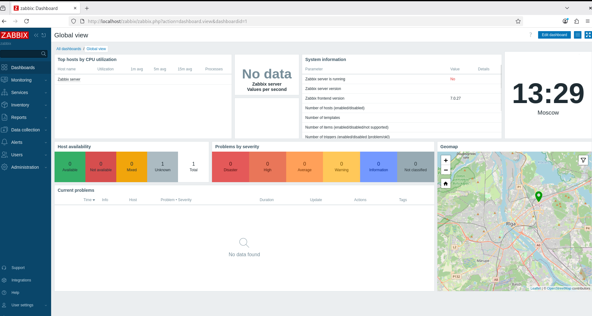

# Домашнее задание к занятию "`Система мониторинга Zabbix`" - `Шаталов Леонид Юрьевич`

# Задание 1

## Установка Zabbix Server 7.0 LTS с PostgreSQL и Apache на Debian 13

### 1. Установка PostgreSQL
sudo apt update
sudo apt install postgresql postgresql-client -y

### 2. Добавление репозитория Zabbix 7.0
wget https://repo.zabbix.com/zabbix/7.0/debian/pool/main/z/zabbix-release/zabbix-release_latest_7.0+debian12_all.deb
sudo dpkg -i zabbix-release_latest_7.0+debian12_all.deb
sudo apt update

### 3. Установка библиотек OpenLDAP 2.5 из Debian 12 (для совместимости)
cd /tmp
wget http://ftp.debian.org/debian/pool/main/o/openldap/libldap-2.5-0_2.5.13+dfsg-5_amd64.deb
sudo dpkg -i libldap-2.5-0_2.5.13+dfsg-5_amd64.deb

### 4. Копирование liblber 2.6 как 2.5
cd /usr/lib/x86_64-linux-gnu/
sudo cp liblber.so.2.0.200 liblber-2.5.so.0.0.0
sudo ln -sf liblber-2.5.so.0.0.0 liblber-2.5.so.0

### 5. Установка пакетов Zabbix
cd /tmp
wget http://repo.zabbix.com/zabbix/7.0/debian/pool/main/z/zabbix/zabbix-server-pgsql_7.0.27-1%2Bdebian12_amd64.deb
wget http://repo.zabbix.com/zabbix/7.0/debian/pool/main/z/zabbix/zabbix-agent_7.0.27-1%2Bdebian12_amd64.deb
wget http://repo.zabbix.com/zabbix/7.0/debian/pool/main/z/zabbix/zabbix-frontend-php_7.0.27-1%2Bdebian12_all.deb
wget http://repo.zabbix.com/zabbix/7.0/debian/pool/main/z/zabbix/zabbix-sql-scripts_7.0.27-1%2Bdebian12_all.deb

sudo dpkg --force-depends -i zabbix-server-pgsql*.deb
sudo dpkg --force-depends -i zabbix-agent*.deb
sudo dpkg -i zabbix-frontend-php*.deb
sudo dpkg -i zabbix-sql-scripts*.deb

### 6. Установка PHP-модуля для PostgreSQL
sudo apt install php-pgsql -y
sudo systemctl restart apache2

### 7. Создание базы данных
sudo -u postgres psql -c "CREATE USER zabbix WITH PASSWORD 'zabbix';"
sudo -u postgres psql -c "CREATE DATABASE zabbix OWNER zabbix;"

### 8. Импорт схемы базы данных
zcat /usr/share/zabbix-sql-scripts/postgresql/server.sql.gz | sudo -u zabbix psql zabbix

### 9. Настройка конфигурации Zabbix Server
sudo sed -i 's/^# DBPassword=.*/DBPassword=zabbix/' /etc/zabbix/zabbix_server.conf

### 10. Настройка pg_hba.conf (разрешить подключение по паролю)
sudo nano /etc/postgresql/16/main/pg_hba.conf
Добавить строку: host all all 127.0.0.1/32 md5
sudo systemctl restart postgresql

### 11. Запуск служб
sudo systemctl enable zabbix-server zabbix-agent
sudo systemctl start zabbix-server zabbix-agent

### 12. Настройка Apache для веб-интерфейса
sudo tee /etc/apache2/conf-available/zabbix.conf << 'EOF'
Alias /zabbix /usr/share/zabbix
<Directory /usr/share/zabbix>
    Options FollowSymLinks
    AllowOverride All
    Require all granted
</Directory>
<Directory /usr/share/zabbix/conf>
    Require all denied
</Directory>
EOF
sudo a2enconf zabbix
sudo systemctl reload apache2

### 13. Вход в админку
Логин: Admin
Пароль: zabbix


---

### Задание 2

`Приведите ответ в свободной форме........`

1. `Заполните здесь этапы выполнения, если требуется ....`
2. `Заполните здесь этапы выполнения, если требуется ....`
3. `Заполните здесь этапы выполнения, если требуется ....`
4. `Заполните здесь этапы выполнения, если требуется ....`
5. `Заполните здесь этапы выполнения, если требуется ....`
6. 

```
Поле для вставки кода...
....
....
....
....
```

`При необходимости прикрепитe сюда скриншоты
`


---

### Задание 3

`Приведите ответ в свободной форме........`

1. `Заполните здесь этапы выполнения, если требуется ....`
2. `Заполните здесь этапы выполнения, если требуется ....`
3. `Заполните здесь этапы выполнения, если требуется ....`
4. `Заполните здесь этапы выполнения, если требуется ....`
5. `Заполните здесь этапы выполнения, если требуется ....`
6. 

```
Поле для вставки кода...
....
....
....
....
```

`При необходимости прикрепитe сюда скриншоты
`

### Задание 4

`Приведите ответ в свободной форме........`

1. `Заполните здесь этапы выполнения, если требуется ....`
2. `Заполните здесь этапы выполнения, если требуется ....`
3. `Заполните здесь этапы выполнения, если требуется ....`
4. `Заполните здесь этапы выполнения, если требуется ....`
5. `Заполните здесь этапы выполнения, если требуется ....`
6. 

```
Поле для вставки кода...
....
....
....
....
```

`При необходимости прикрепитe сюда скриншоты
`
